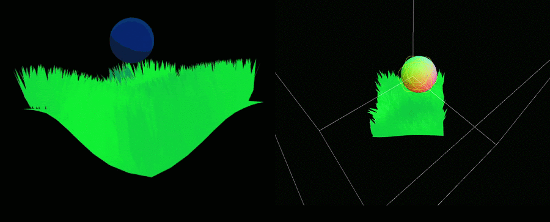

# **Volumetric Interaction**

This project involves developing a dynamic volumetric (3D) texture rendering implementation to
assess the viability of dynamic volumetric textures in games. The viability will be gauged by
performance benchmarks across multiple devices.

By using dynamic volumetric textures for environment interaction, multiple shortcomings of
traditional approaches can be subverted, resulting in more immersive virtual environments.

[See the full report here](Volumetric%20Interaction%20-%20Report.pdf)